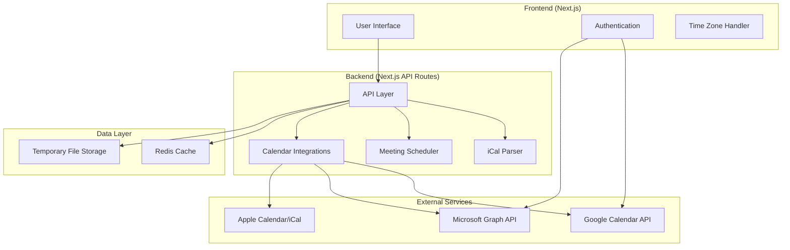

# Design Document

## Overview

The Group Meeting Scheduler is a full-stack web application built with Next.js and deployed on Vercel. The system processes calendar data from multiple sources (iCal files and direct calendar integrations) to identify optimal meeting times using intelligent scheduling algorithms. The architecture emphasizes security, performance, and user experience while handling complex time zone calculations and calendar data parsing.

## Architecture

### High-Level Architecture



### Technology Stack

- **Frontend**: Next.js 14 with TypeScript, Tailwind CSS, React Hook Form
- **Backend**: Next.js API Routes with TypeScript
- **Calendar Parsing**: Custom iCal parser with rrule support for recurring events
- **Authentication**: NextAuth.js with OAuth providers
- **Caching**: Redis (via Upstash for Vercel compatibility)
- **File Storage**: Vercel Blob for temporary iCal file storage
- **Deployment**: Vercel with Edge Functions for optimal performance

## Components and Interfaces

### Core Components

#### 1. Calendar Data Processor

```typescript
interface CalendarEvent {
  id: string;
  summary: string;
  start: Date;
  end: Date;
  timezone: string;
  recurrence?: RecurrenceRule;
  status: "confirmed" | "tentative" | "cancelled";
}

interface ParticipantCalendar {
  participantId: string;
  name: string;
  timezone: string;
  events: CalendarEvent[];
  source: "ical" | "google" | "outlook" | "apple";
}
```

#### 2. Meeting Scheduler Engine

```typescript
interface MeetingPreferences {
  duration: number; // minutes
  timeRangeStart: string; // "09:00"
  timeRangeEnd: string; // "17:00"
  excludeWeekends: boolean;
  excludedDates: Date[];
  bufferTime: number; // minutes
  preferredTimezones: string[];
}

interface TimeSlot {
  start: Date;
  end: Date;
  score: number; // 0-100 based on preferences
  conflicts: string[]; // participant IDs with conflicts
  timezoneDisplay: Record<string, string>; // timezone -> formatted time
}

interface SchedulingResult {
  availableSlots: TimeSlot[];
  conflictAnalysis: ConflictSummary;
  recommendations: TimeSlot[];
}
```

#### 3. Calendar Integration Service

```typescript
interface CalendarIntegration {
  authenticate(provider: "google" | "outlook"): Promise<AuthResult>;
  fetchCalendarData(
    token: string,
    dateRange: DateRange
  ): Promise<CalendarEvent[]>;
  createCalendarEvent(token: string, event: CalendarEvent): Promise<string>;
}
```

### API Endpoints

#### Calendar Management

- `POST /api/calendars/upload` - Upload iCal files
- `POST /api/calendars/connect` - Connect to calendar providers
- `GET /api/calendars/[sessionId]` - Retrieve processed calendar data
- `DELETE /api/calendars/[sessionId]` - Clean up session data

#### Meeting Scheduling

- `POST /api/meetings/analyze` - Analyze calendars and find available slots
- `POST /api/meetings/create` - Create meeting invitation
- `GET /api/meetings/[meetingId]/status` - Check participant responses

#### Authentication

- `GET /api/auth/[...nextauth]` - NextAuth.js authentication endpoints

## Data Models

### Database Schema (Redis)

```typescript
// Session data (expires in 24 hours)
interface SchedulingSession {
  id: string;
  createdAt: Date;
  expiresAt: Date;
  participants: ParticipantCalendar[];
  preferences: MeetingPreferences;
  results?: SchedulingResult;
}

// Meeting data (expires in 7 days)
interface Meeting {
  id: string;
  organizerId: string;
  title: string;
  selectedSlot: TimeSlot;
  participants: ParticipantResponse[];
  status: "pending" | "confirmed" | "cancelled";
  createdAt: Date;
}

interface ParticipantResponse {
  participantId: string;
  email: string;
  status: "pending" | "accepted" | "declined";
  respondedAt?: Date;
}
```

### iCal Parsing Strategy

The system will use a multi-stage parsing approach:

1. **Validation**: Verify iCal format and required fields
2. **Event Extraction**: Parse VEVENT components with proper timezone handling
3. **Recurrence Processing**: Expand recurring events using rrule library
4. **Normalization**: Convert all times to UTC for internal processing
5. **Conflict Detection**: Identify overlapping events and busy periods

### Time Zone Handling

- All internal calculations performed in UTC
- Client timezone detection via browser API
- Support for participant-specific timezone preferences
- Automatic DST handling using date-fns-tz library

## Error Handling

### Error Categories

1. **Validation Errors**

   - Invalid iCal format
   - Missing required fields
   - Unsupported calendar features

2. **Integration Errors**

   - OAuth authentication failures
   - API rate limiting
   - Network timeouts

3. **Processing Errors**
   - Timezone conversion failures
   - Scheduling algorithm errors
   - Data corruption

### Error Response Format

```typescript
interface ErrorResponse {
  error: {
    code: string;
    message: string;
    details?: Record<string, any>;
    suggestions?: string[];
  };
  timestamp: string;
  requestId: string;
}
```

### Fallback Strategies

- **Calendar Integration Failures**: Fallback to manual iCal upload
- **Parsing Errors**: Provide detailed error messages with correction suggestions
- **No Available Slots**: Suggest alternative durations or expanded time ranges
- **Timezone Issues**: Default to organizer's timezone with clear warnings

## Testing Strategy

### Unit Testing

- **Calendar Parser**: Test with various iCal formats and edge cases
- **Scheduling Algorithm**: Verify optimal time selection logic
- **Time Zone Conversion**: Test DST transitions and edge cases
- **API Endpoints**: Mock external services and test error scenarios

### Integration Testing

- **OAuth Flows**: Test authentication with actual calendar providers
- **End-to-End Scheduling**: Complete workflow from upload to meeting creation
- **Cross-Browser Compatibility**: Test on major browsers and mobile devices

### Performance Testing

- **Large Calendar Processing**: Test with calendars containing 1000+ events
- **Concurrent Users**: Simulate multiple simultaneous scheduling sessions
- **API Response Times**: Ensure sub-3-second response times

### Security Testing

- **Data Privacy**: Verify calendar data is properly encrypted and deleted
- **OAuth Security**: Test token handling and refresh mechanisms
- **Input Validation**: Test against malicious iCal files and XSS attempts

### Test Data Strategy

- **Synthetic Calendars**: Generate test calendars with various complexity levels
- **Real-World Scenarios**: Test with actual exported calendar files
- **Edge Cases**: Empty calendars, all-day events, recurring events with exceptions

### Automated Testing Pipeline

- **Pre-commit Hooks**: Run linting and unit tests
- **CI/CD Integration**: Full test suite on pull requests
- **Deployment Testing**: Smoke tests on Vercel preview deployments
- **Monitoring**: Real-time error tracking and performance monitoring
